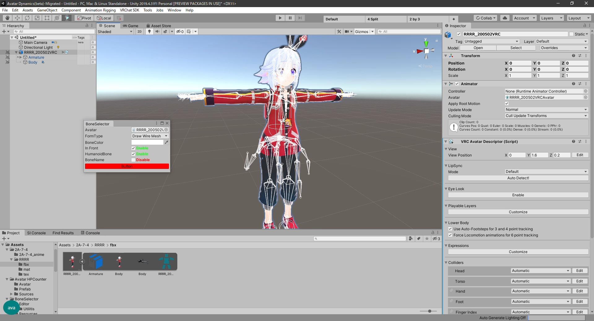
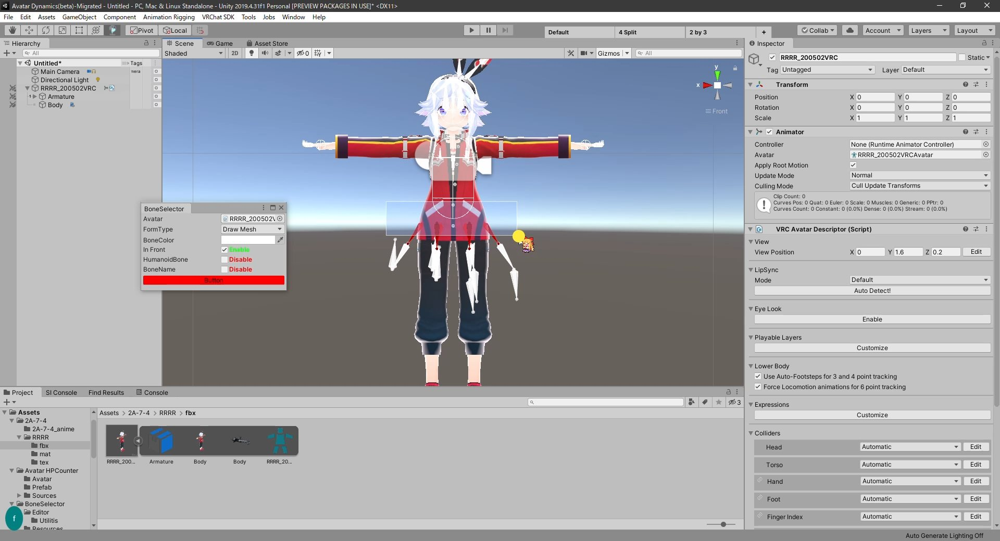

## 説明

BoneSelectorはシーン上にアバターのボーンを表示し、選択、操作しやすくするツールです

### ボーン表示

アバターのArmature以下にあるオブジェクトの一覧を表示出来ます

表示形式は「ボーン」「ボーンのワイヤーのみ」「スフィアのみ」の3タイプから選択できます

### ボーン選択

シーン上で表示されているボーンをクリックすることで対象のボーンを選択できます

また、範囲選択することで囲まれている範囲のボーンを一括で選択することができます

### ボーン操作

選択したボーンはハイライトされ、編集対象が分かりやすくなります

また、ボーン表示中にボーンの移動・回転・拡大縮小を行っても、ボーン表示を終了した時に元の形に戻るのでボーンの動きの確認にも使用できます

### Playモード(再生モード)

BoneSelectorはPlayモード(再生モード)でも動作するので、揺れものやアニメーションの動きの確認にも使用できます