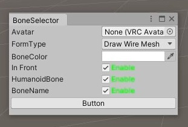
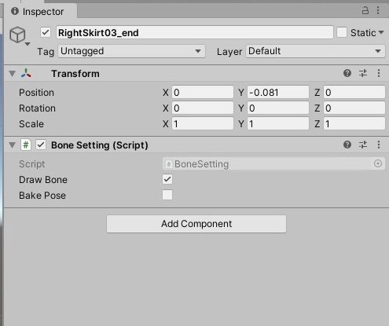

## エディターの見かた

エディターウィンドウではBoneSelectorの表示をカスタマイズできます

### 1.Avatar
ボーンを表示させたいアバターを選択します。現在、AvatarDiscriptorの付いたアバターのみが対象となっています。

### 2.FormType
ボーンの表示形式を変更します

### 3.BoneColor
ボーンの色を変更できます

### 4.InFront
ボーンを最前面に表示するかどうかを変更します。現在WireMesh式では機能しません。

### 5.HumanoidBone
Rigでヒューマノイドに設定したボーンを表示するかどうかを設定します。

### 6.BoneName
ボーンの名前を表示するかどうかを設定します

### 7.Button
ボーンの表示のオンオフをコントロールします。ボーン表示中に動かしたボーンは機能をオフにすると元の位置に戻ります。

## コンポーネントの見かた
ボーンを表示中は各ボーンにBoneSettingというコンポーネントが付きます
こちらではボーンの操作をコントロールできます

### 1.DrawBone
選択したボーンを非表示にできます。一時的に表示を消しておきたいボーンはこちらをオフにしてください。

### 2.BakePose
オンにするとボーン表示中に動かしたボーンの位置を固定できます